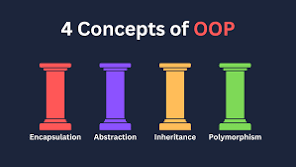

# Introduction

>> Voici la synthese des introduction de chaque sujet du module cpp.

L'introduction nous présente [le langage C++](https://etudestech.com/decryptage/apprendre-programmation-informatique/).

C'est un code à usage général créé par [Bjarne Stroustrup](https://fr.wikipedia.org/wiki/Bjarne_Stroustrup)

 

(il est un danois).

C++ était à la base conçu comme une extension du [langage C](https://fr.wikipedia.org/wiki/C_(langage)).

C++ est versatile, on peut faire [différents types de programmation](https://etudestech.com/decryptage/apprendre-programmation-informatique/) :

- POO (programmation orientée objet)
- Programmation générique
- Programmation procédurale

Le C++ est utilisé dans de nombreux domaines grâce à son efficacité et sa compatibilité, mais généralement utilisé dans des applications où les performances sont importantes.

Dans ce module la notion que nous allons voir est ...

## LA POO

La POO acronyme de Programation oritentée objet (OOP Object-Oriented Programming)

>> OOP (Object-Oriented Programming): une approche de programmation qui met l’accent sur les objets et leurs interactions plutôt que sur les fonctions et les algorithmes. Il permet de représenter les concepts réels dans le code source en utilisant des classes, des objets et des méthodes.

(c'est une notion que j'ai apris avec le langage python perso :)).

## C++98

L'énoncé nous indique que nous utiliserons le C++98 et non celui d'aujourd'hui pour complexifier les exercices et nous faire bien comprendre les notions demandées. Si on souhaite approfondir le C++, on peut le faire de manière autonome et chaque exercice/module nous fera découvrir de nouvelles notions.

